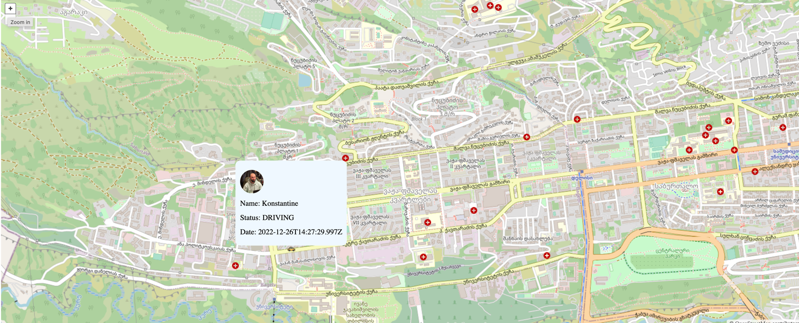

## Taxi APP Demo (Openlayers, Node.js)

### Description:
A demo project of taxi cars moving around shown on map as live location with 
metadata

### Screenshots:

### How to run locally:

* Run Server:
  * Go to `server` dir
  * Run `npm install`
  * Run `npm run start`
* Run client:
  * Go to `client` dir
  * Run `npm install`
  * Run `npm run start` 

### How to run in production:
Change the client's base url of the server accordingly (dir: `client/js/main.js`)
* Build `client` and `server` as a docker image: 
  * For server: `docker build -t <image-name> server/`
  * For client: `docker build -t <image-name> client/`
* Push images to an image registry (hub.docker.com)
* On your VM machine perform `docker login` to your docker image registry account
* To start the apps:
  * For server: `docker run -p 3000:3000 -d <server image name>`
  * For client: `docker run -p 80:80 -d <client image name>`

For other docker commands google <3 or as ChatGPT 

### Technologies used:
* Openlayers
* Node.js

#### Authors:
* Konstantine Dvalishvili